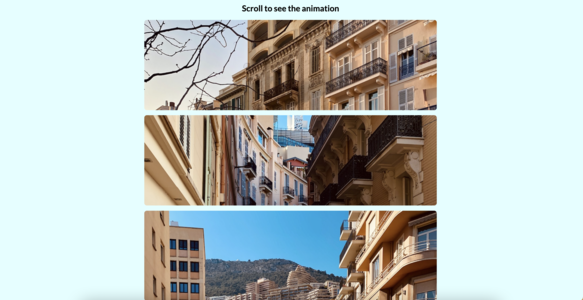

# Scroll Animation

<p align="center">
    <a href="#">Live Demo</a>
</p>

---
[50days50projects]第6天的练习：Scroll Animation。当页面滚动时，图片分别从左右滑动进入页面。

## What I Learned
1. JavaScript: `Element.getBoundingClientRect()`方法用于获取元素相对于视口（网页窗口）的位置和大小信息。返回一个 `DOMRect`对象，其中包含了四个属性：left、top、right和bottom。，提供了元素的大小及其相对于viewport的位置。

    - `DOMRect`对象中的`width`和`height`包括了`padding`和`border-width`；但如果是`box-sizing: border-box`，`DOMRect`对象中的`width`和`height`直接与元素的`width`和`height`相等。
    - 使用Element.getBoundingClientRect()方法可以方便地计算出元素相对于视口的位置坐标和大小信息，从而实现了一些常见的页面布局计算与优化等功能。
2. JavaScript: 元素滚动事件监听
    ```JavaScript
    window.addEventListener("scroll", checkBoxes);
    ```
3. JavaScript: 计算触发显示元素的位置`triggerBottom`，也就是窗口高度的4/5。
    ```JavaScript
    const triggerBottom = window.innerHeight / 5 * 4;
    ```
4. JavaScript: 遍历所有`box`元素，判断其顶部位置是否小于当前页面底部位置`triggerBottom`，如果小于，则该元素可见，添加CSS类名`show`，如果大于，则该元素不可见，移除CSS类名`show`。
    ```JavaScript
    boxes.forEach(box => {
        const boxTop = box.getBoundingClientRect().top;

        if(boxTop < triggerBottom) {
            box.classList.add("show");
        }
        else{
            box.classList.remove("show");
        }
    })
    ```
    - 对于每个`box`元素，使用`getBoundingClientRect()`获取该元素的边界矩形信息，并从中获取顶部位置信息：`const boxTop = box.getBoundingClientRect().top;`
    - 对于每个`box`元素，判断其顶部位置是否小于当前页面底部位置`triggerBottom`

## Reference
-[MDN - Element.getBoundingClientRect()](https://developer.mozilla.org/zh-CN/docs/Web/API/Element/getBoundingClientRect)